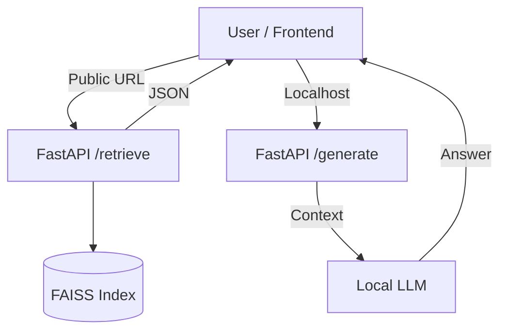
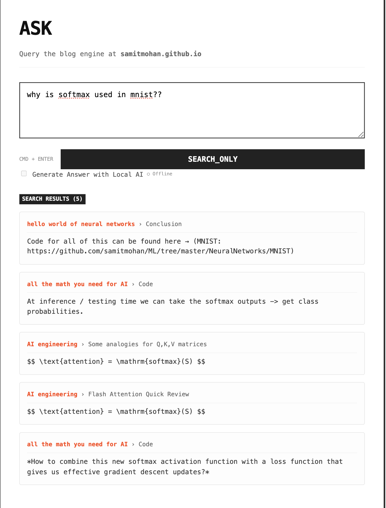

# Blog RAG Engine 

A hybrid retrieval-augmented generation (RAG) engine for my personal blog, [samitmohan.github.io](https://samitmohan.github.io). It allows users to query my technical posts using semantic search and provides AI-generated answers grounded in my writing.

## Features

- **Semantic Search**: Indexes blog posts using `FAISS` and `SentenceTransformers` to find relevant content by meaning, not just keywords.
- **Dual-Mode Architecture**:
  - **Public Mode (Search)**: Runs purely on retrieval (CPU-only). Fast, free, and deployable anywhere. Returns relevant excerpts.
  - **Local Mode (AI Chat)**: When running locally, connects to a local LLM (`Qwen 2.5:7b` via Ollama) to synthesize answers from the retrieved chunks.
- **Smart Chunking**: intelligently splits markdown posts, preserving code blocks and section context.
- **Citation-Backed**: Every answer cites specific sections of my blog posts to prevent hallucinations.

## Architecture



## Setup

### Prerequisites

- Python 3.10+
- [Ollama](https://ollama.com/) (for local AI generation)

### Installation

1.  **Clone the repository**:
    ```bash
    git clone https://github.com/samitmohan/blog-rag.git
    cd blog-rag
    ```

2.  **Install dependencies**:
    ```bash
    pip install -r requirements.txt
    ```

3.  **Download the LLM**:
    ```bash
    ollama pull qwen2.5:7b
    ```

### Running the System

1.  **Start the Backend**:
    ```bash
    uvicorn backend.app:app --reload --port 8000
    ```

2.  **Ingest Content** (Build the Index):
    This fetches posts from your GitHub, chunks them, and builds the vector store.
    ```bash
    curl -X POST "http://localhost:8000/ingest"
    ```

3.  **Start the Frontend**:
    ```bash
    python3 -m http.server 8080
    ```
    Visit `http://localhost:8080` to interact with the system.

## Project Structure

- `backend/`: FastAPI server handling retrieval and generation requests.
- `ingestion/`: Logic for fetching, parsing, cleaning, and chunking markdown files.
- `embeddings/`: Handles vector embedding creation and FAISS index management.
- `retrieval/`: Search logic, intent classification, and re-ranking.
- `generation/`: Prompt engineering and interfacing with the local LLM.
- `index.html`: Dual-mode frontend (Public Search + Local Chat).

## Deployment

The frontend (`index.html`) is designed to be hosted on GitHub Pages. 
- It defaults to **Public Search Mode** (connecting to a public retrieval endpoint).
- It auto-upgrades to **AI Chat Mode** if it detects the backend running locally on `localhost:8000`.



## License

MIT